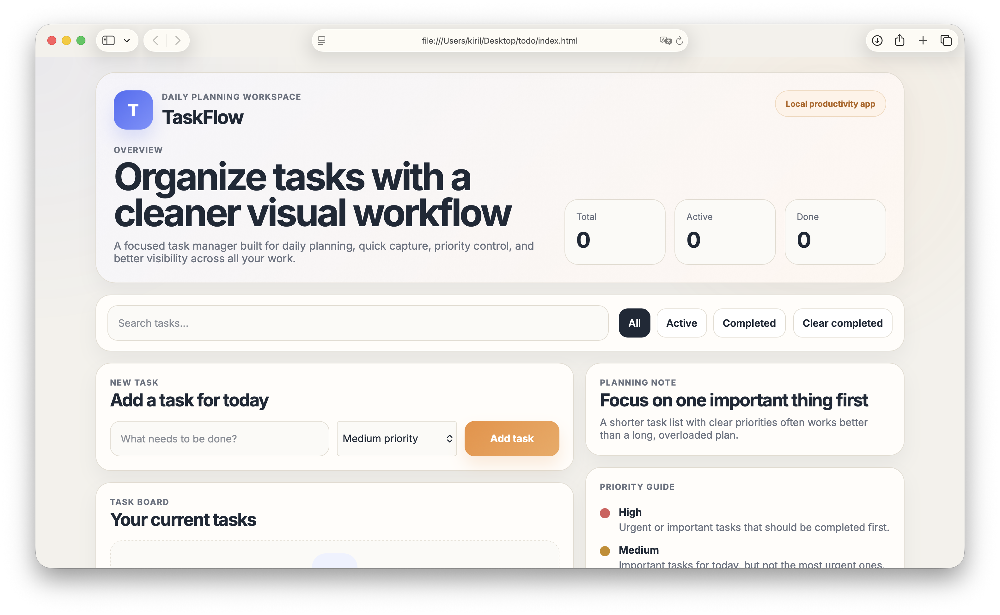

# TaskFlow — Daily Planning Workspace

**TaskFlow** — это современный веб-менеджер задач для ежедневного планирования. Приложение позволяет создавать, фильтровать, искать и отслеживать задачи с приоритетами. Все данные сохраняются локально в браузере.

[**Посмотреть демо**](https://neossakura.github.io/taskflow-one/)

---

## 📋 Функциональность

### Основные возможности
- ✅ **Создание задач** — добавление новых задач с указанием приоритета (низкий/средний/высокий)
- 🔍 **Поиск** — мгновенный поиск по названию задачи
- 🎯 **Фильтрация** — просмотр всех/активных/выполненных задач
- 🗑️ **Управление** — отметка о выполнении, удаление отдельных задач, очистка выполненных
- 💾 **Локальное хранение** — данные сохраняются в localStorage браузера
- 📊 **Статистика** —实时 отображение количества задач и процента выполнения

### Интерфейс
- Адаптивный дизайн (desktop + mobile)
- Визуальное разделение по приоритетам
- Чистая и минималистичная эстетика
- Интерактивные элементы с обратной связью

---

## 🛠️ Используемые технологии

- **HTML5** — семантическая структура страницы.
- **CSS3** — flexbox, grid, анимации, медиазапросы (адаптив).
- **JavaScript (ES6)** — логика для мобильного меню, плавного скролла, анимаций и FAQ-аккордеона.
- **Google Fonts** — шрифт `Inter`.
- **Методология BEM** — для организации имен классов.

---
